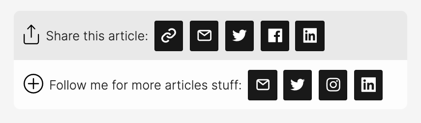

# React Social Share & Follow

**React component for Share and Follow on social networks**

## Example

## Installation

    yarn add react-share-follow  # or: npm install react-share-follow

## Syntax

    import { SocialShareAndFollow } from 'react-share-follow'
    import 'node_modules/react-share-follow/dist/SocialShareAndFollow.css'
    
    <SocialShareAndFollow
      url={'https://www.mysite.com/'}
      title='My title'
      description='My description'
      labelShare='Share this article'
      labelFollow='Follow me for more cool stuff'
      iconColor='black'
      share={{
        copy: true,
        email: true,
        sms: false,
        facebook: true,
        twitter: true,
        reddit: false,
        pinterest: true,
        linkedin: true
      }}
      follow={{
        email: signupEmailFunction,
        web: 'https://www.tomsoderlund.com/',
        twitter: 'tomsoderlund',
        instagram: 'tomsoderlund',
        linkedin: 'in/tomsoderlund'
      }}
      onShare={({ message }) => window.alert(message)}
    />

## How to build and publish a new NPM package

    yarn publish  # yarn prepare (Babel) will be run automatically
